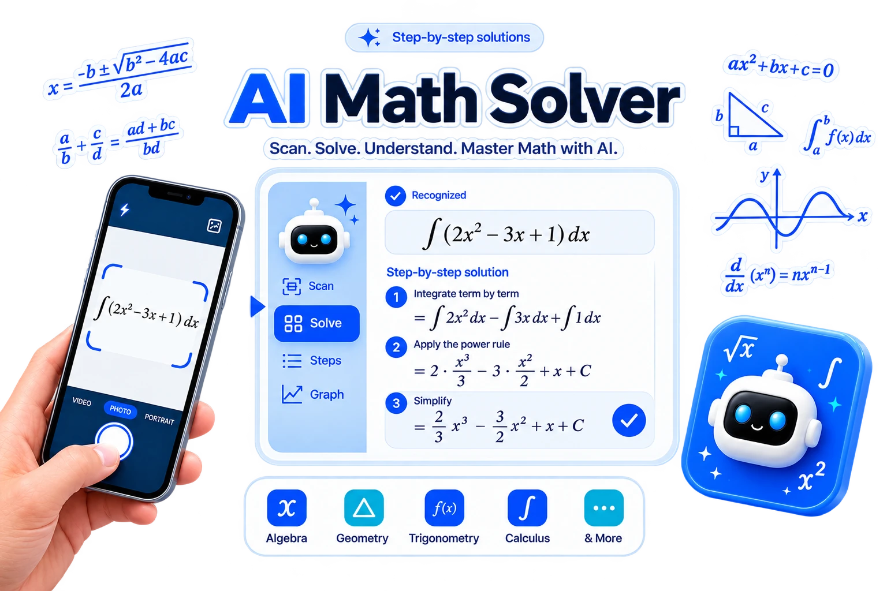
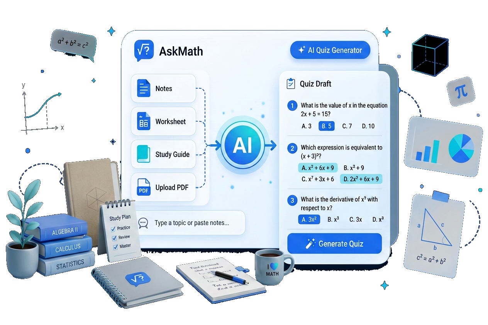
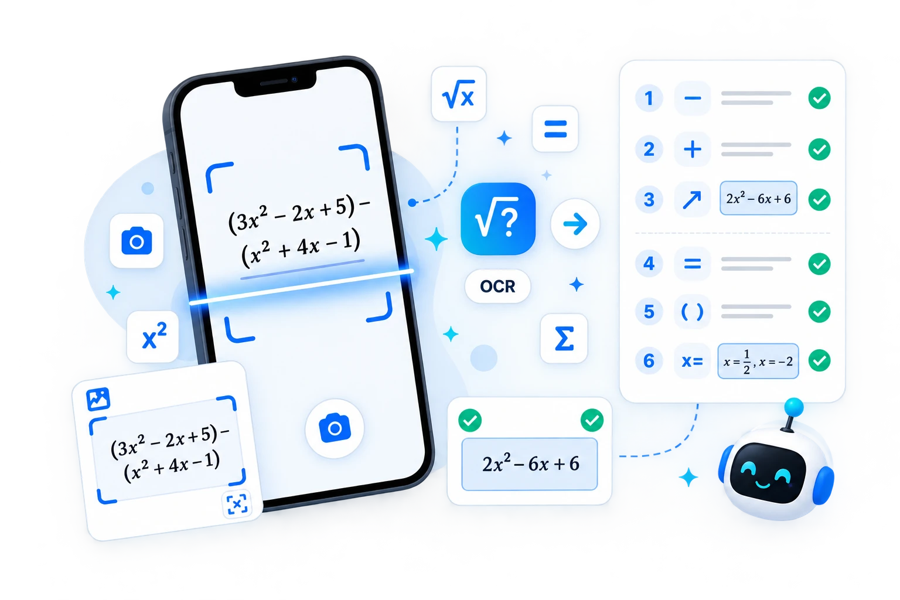
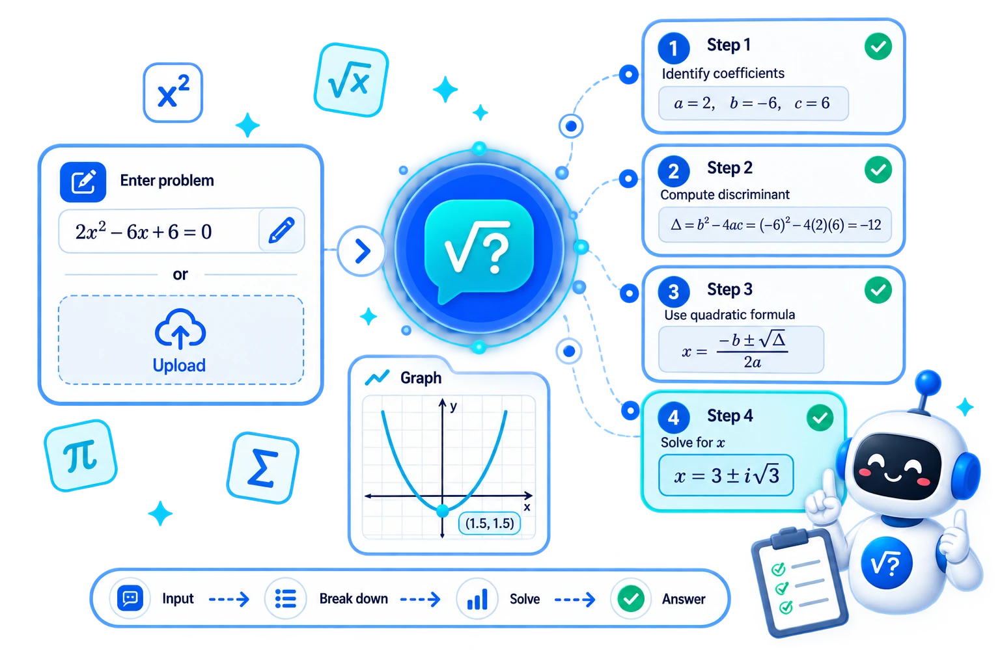

<div align="center">

# 🧮 AskMath
### *Next-Generation AI Math Problem Solver, Interactive Practice Suite & Dynamic Graphing Engine*

[](https://vitejs.dev/)
[](https://tailwindcss.com/)
[](https://developer.mozilla.org/en-US/docs/Web/JavaScript)
[](https://cortexjs.io/mathlive/)
[](LICENSE)
[](https://github.com/)

<p align="center">
  <a href="#-features">Features</a> •
  <a href="#-visual-showcase">Showcase</a> •
  <a href="#️-tech-stack">Tech Stack</a> •
  <a href="#-getting-started">Getting Started</a> •
  <a href="#-engineering--performance">Performance</a> •
  <a href="#-developer">Developer</a>
</p>

---

</div>

## 📌 Overview

**AskMath** is a high-performance, responsive mathematics workspace and problem-solving application engineered for students, educators, and researchers. It bridges modern web engineering with rich educational tooling—offering **multi-modal mathematical input** (Text, Image/OCR scan, Handwriting, MathLive LaTeX keyboard, and Web Speech API voice input), **step-by-step AI-assisted problem breakdowns**, an **interactive 2D canvas graphing calculator**, and an **adaptive practice & quiz generation suite**.

Built with a clean **Vanilla JavaScript (ES6+)** architecture, **Tailwind CSS v4**, and **Vite 6**, AskMath delivers instantaneous load times, fluid 60 FPS graph rendering, and an intuitive dark/light mode user experience across all device form factors.

---

## ✨ Key Features

### 🧮 1. Multi-Modal AI Math Solver
- **Multi-Input Channels**: Enter equations via standard text, interactive **MathLive** virtual keyboard, image upload (OCR photo scan), canvas handwriting, or voice speech recognition.
- **LaTeX Math Rendering**: High-fidelity mathematical notation rendering powered by **MathJax**.
- **Topic Coverage**: Comprehensive support for:
  - *Algebra* (Linear, Quadratic, Polynomials, Systems of Equations)
  - *Calculus* (Derivatives, Integrals, Limits, Series)
  - *Trigonometry* (Identities, Angles, Graphs)
  - *Geometry, Statistics & Word Problems*
- **Step-by-Step Breakdown**: Detailed logical breakdown of each problem-solving phase to deepen conceptual understanding.

### 📈 2. Interactive 2D Graphing Calculator
- **Dynamic Expression Engine**: Plot single or multiple functions simultaneously (polynomials, trigonometric, logarithmic, exponential, and power functions).
- **Smooth Canvas Controls**: Pan, zoom, coordinate auto-fit, and customizable Cartesian grid resolution.
- **Export & Share**:
  - 📷 **Export as PNG**: High-resolution canvas snapshot generation.
  - 💾 **Export as JSON**: Save graph configurations and equations.
  - 🖨️ **Print View**: Formatted workspace layout for physical printouts.

### 📝 3. Practice & Quiz Generator
- **Customizable Problem Sets**: Tailor practice tests with configurable question volumes, difficulty tiers, and topic filters.
- **Scenario Workflows**: Dedicated templates for **Classroom Learning**, **Independent Homework Practice**, and **Personalized Tutoring**.
- **Instant Drafts & PDF Export**: Generate printable quiz sheets and worksheets on demand.

### 🔢 4. Embedded Scientific Calculator & Voice Input
- **Quick Utility Drawer**: In-app arithmetic and scientific operations integrated directly with the primary solver workspace.
- **Voice Recognition (Web Speech API)**: Dictate complex mathematical queries with real-time feedback and microphone status indicators.

### 🌓 5. Adaptive UI, Theme Engine & Design System
- **Dual Theme Support**: System-aware and persistent **Light & Dark themes**.
- **Responsive Layout**: Collapsible sidebar navigation for desktop and a drawer for mobile views.
- **Accessible Iconography**: Clean, lightweight **Lucide Icons** integration with scoped rendering.

---

## 📸 Visual Showcase

<div align="center">

| 🧮 AI Problem Solver | 📝 Practice & Quiz Generator |
|:---:|:---:|
|  |  |
| *Step-by-Step Solution & OCR Input* | *Customizable Practice & Test Engine* |

| 🔍 OCR & Scan Recognition | 📊 Step-by-Step Solutions |
|:---:|:---:|
|  |  |
| *Image-to-Equation Processing* | *Deep Conceptual Explanations* |

</div>

---

## 🛠️ Tech Stack

| Category | Technology | Description |
|---|---|---|
| **Core Architecture** | **Vanilla JavaScript (ES6+)** | Zero-framework runtime for optimal speed and minimal memory footprint |
| **Markup & Semantics** | **HTML5** | Semantic, accessible structure with ARIA-compliant attributes |
| **Styling & Design** | **Tailwind CSS v4** | Next-generation utility-first styling with modern CSS variables |
| **Build & Bundling** | **Vite 6** | Lightning-fast HMR and optimized tree-shaken production bundles |
| **Math Input Engine** | **MathLive** | Interactive virtual mathematical keyboard and LaTeX editor |
| **LaTeX Typesetting** | **MathJax 3** | High-precision mathematical formula and equation rendering engine |
| **Graphics & Visualization** | **HTML5 Canvas API** | Hardware-accelerated 2D Cartesian plane rendering |
| **Voice Interface** | **Web Speech API** | Browser-native voice recognition for verbal mathematical input |
| **Icons & Media** | **Lucide Icons & WebP** | Modern icon system and compressed next-gen image assets |

---

## 📂 Project Structure

```text
AskMath/
├── images/                   # Next-gen WebP feature banners, avatars & icons
├── src/
│   ├── js/
│   │   └── main.js           # Core application logic, solvers, graph canvas & UI
│   └── input.css             # Tailwind CSS v4 design tokens and custom utilities
├── index.html                # Main semantic application entry point
├── package.json              # Project scripts and dependencies
├── vite.config.js            # Vite build configuration and plugins
├── .gitignore                # Git exclusions
└── README.md                 # Project documentation
```

---

## 🚀 Getting Started

Follow these steps to set up the project locally on your machine.

### Prerequisites

Ensure you have the following installed:
- [Node.js](https://nodejs.org/) (Version **18.0.0** or higher recommended)
- [npm](https://www.npmjs.com/) (Version **9.0.0** or higher) or [yarn](https://yarnpkg.com/) / [pnpm](https://pnpm.io/)

### Installation

1. **Clone the Repository**
   ```bash
   git clone https://github.com/muhammad-usman-web-dev/askmath.git
   cd askmath
   ```

2. **Install Dependencies**
   ```bash
   npm install
   ```

3. **Start the Development Server**
   ```bash
   npm run dev
   ```
   Open your browser and navigate to `http://localhost:5173`.

---

## 📜 Available Scripts

| Command | Description |
|---|---|
| `npm run dev` | Launches the local Vite development server with Hot Module Replacement (HMR) |
| `npm run tw` | Starts Vite and automatically opens the application in your default browser |
| `npm run build` | Compiles and optimizes assets into the `dist/` directory for production |
| `npm run preview` | Locally serves and previews the generated production build |

---

## ⚡ Engineering & Performance Highlights

- **Zero Heavy Framework Overhead**: Built with clean Vanilla JavaScript, avoiding excessive virtual DOM diffing and keeping the initial payload lightweight.
- **Optimized Canvas Rendering**: The 2D graphing engine uses `requestAnimationFrame` and memoized expression AST compilation to eliminate redundant repaints during pan and zoom gestures.
- **Next-Gen Asset Pipeline**: All image assets are formatted as compressed WebP with predefined layout dimensions to achieve near-zero Cumulative Layout Shift (CLS).
- **Non-Blocking LaTeX Processing**: MathJax typesetting requests are queued and throttled to ensure UI responsiveness during real-time mathematical typing.
- **Scoped Icon Rendering**: Dynamic Lucide icon instantiation targets specific DOM subtrees to prevent full-page DOM traversals.

---

## 👨‍💻 Developer & Internship Context

This application was created by **Muhammad Usman** as an engineering project developed during an internship at **Csoft**, demonstrating core competencies in frontend architecture, mathematical computing, responsive design systems, and performance optimization.

- **Developer:** [Muhammad Usman](https://github.com/muhammad-usman-web-dev)
- **Role:** Frontend Development Intern
- **Organization:** Csoft (*Powered by Csoft*)

<div align="center">

[](https://github.com/muhammad-usman-web-dev)
[](https://linkedin.com/in/your-profile)
[](https://yourportfolio.com)

</div>

---

## 📄 License

Distributed under the **MIT License**. See [`LICENSE`](LICENSE) for more information.

---

<div align="center">
  <sub>Built with ❤️ by Muhammad Usman. If you find this project useful, please consider giving it a ⭐ on GitHub!</sub>
</div>
